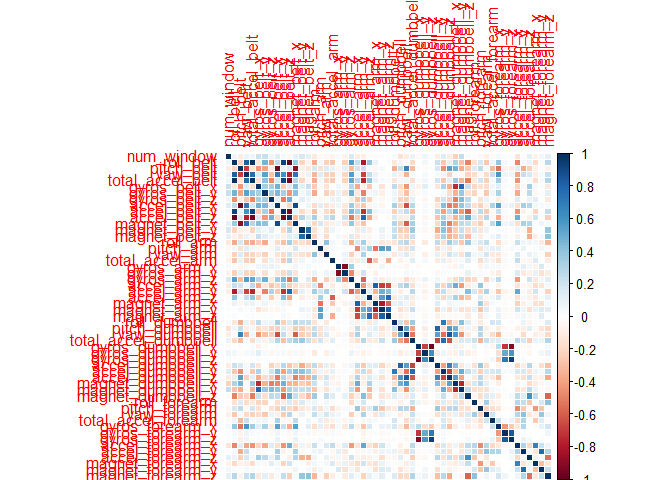

# Practical Machine Learning Course Project
Khanh Nguyen  
September 26, 2015  

#Introduction

Using devices such as Jawbone Up, Nike FuelBand, and Fitbit it is now possible to collect a large amount of data about personal activity relatively inexpensively. These type of devices are part of the quantified self movement - a group of enthusiasts who take measurements about themselves regularly to improve their health, to find patterns in their behavior, or because they are tech geeks. One thing that people regularly do is quantify how much of a particular activity they do, but they rarely quantify how well they do it.

This project uses data from accelerometers on the belt, forearm, arm, and dumbell of 6 research study participants. The training data consists of accelerometer data and a label identifying the quality of the activity the participant was doing. The testing data consists of accelerometer data without the identifying label. The goal is to predict the labels for the test set observations. Below is the code I used when creating the model, estimating the out-of-sample error, and making predictions. The description of each step of the process is given in details.

#Data Preprocessing


```
## Loading required package: lattice
## Loading required package: ggplot2
```

##Download the Data


```r
trainUrl <-"https://d396qusza40orc.cloudfront.net/predmachlearn/pml-training.csv"
testUrl <- "https://d396qusza40orc.cloudfront.net/predmachlearn/pml-testing.csv"
trainFile <- "./data/pml-training.csv"
testFile  <- "./data/pml-testing.csv"
if (!file.exists("./data")) {
  dir.create("./data")
}
if (!file.exists(trainFile)) {
  download.file(trainUrl, destfile=trainFile)
}
if (!file.exists(testFile)) {
  download.file(testUrl, destfile=testFile)
}
```

##Load the Data

After downloading the data from the data source, we can read the two csv files into two data frames.


```r
trainData <- read.csv("./data/pml-training.csv")
testData <- read.csv("./data/pml-testing.csv")
dim(trainData)
```

```
## [1] 19622   160
```

```r
dim(testData)
```

```
## [1]  20 160
```

The training data set contains 19622 observations and 19622, 160 variables, while the testing data set contains 20 observations and 20, 160 variables. The "classe" variable in the training set is the outcome to predict.

##Clean the Data

In this step, I am going to reduce the number of features by removing variables with nearly zero variance, variables that are almost always NA, and variables that don't make intuitive sense for prediction.


```r
# remove variables with nearly zero variance
nzv <- nearZeroVar(trainData)
trainData <- trainData[, -nzv]
testData <- testData[, -nzv]
# remove variables that are almost always NA
mostlyNA <- sapply(trainData, function(x) mean(is.na(x))) > 0.95
trainData <- trainData[, mostlyNA==F]
testData <- testData[, mostlyNA==F]
```

Next, remove some columns that do not contribute much to the accelerometer measurements.


```r
# Remove variables which do not contribute much to the accelerometer measurements.
removeIndex <- grep("timestamp|X|user_name|new_window", names(trainData))
trainData <- trainData[, -removeIndex]
# Show remaining columns of training data.
colnames(trainData)
```

```
##  [1] "num_window"           "roll_belt"            "pitch_belt"          
##  [4] "yaw_belt"             "total_accel_belt"     "gyros_belt_x"        
##  [7] "gyros_belt_y"         "gyros_belt_z"         "accel_belt_x"        
## [10] "accel_belt_y"         "accel_belt_z"         "magnet_belt_x"       
## [13] "magnet_belt_y"        "magnet_belt_z"        "roll_arm"            
## [16] "pitch_arm"            "yaw_arm"              "total_accel_arm"     
## [19] "gyros_arm_x"          "gyros_arm_y"          "gyros_arm_z"         
## [22] "accel_arm_x"          "accel_arm_y"          "accel_arm_z"         
## [25] "magnet_arm_x"         "magnet_arm_y"         "magnet_arm_z"        
## [28] "roll_dumbbell"        "pitch_dumbbell"       "yaw_dumbbell"        
## [31] "total_accel_dumbbell" "gyros_dumbbell_x"     "gyros_dumbbell_y"    
## [34] "gyros_dumbbell_z"     "accel_dumbbell_x"     "accel_dumbbell_y"    
## [37] "accel_dumbbell_z"     "magnet_dumbbell_x"    "magnet_dumbbell_y"   
## [40] "magnet_dumbbell_z"    "roll_forearm"         "pitch_forearm"       
## [43] "yaw_forearm"          "total_accel_forearm"  "gyros_forearm_x"     
## [46] "gyros_forearm_y"      "gyros_forearm_z"      "accel_forearm_x"     
## [49] "accel_forearm_y"      "accel_forearm_z"      "magnet_forearm_x"    
## [52] "magnet_forearm_y"     "magnet_forearm_z"     "classe"
```

```r
testData <- testData[, -removeIndex]
# Show remaining columns of testing data.
colnames(testData)
```

```
##  [1] "num_window"           "roll_belt"            "pitch_belt"          
##  [4] "yaw_belt"             "total_accel_belt"     "gyros_belt_x"        
##  [7] "gyros_belt_y"         "gyros_belt_z"         "accel_belt_x"        
## [10] "accel_belt_y"         "accel_belt_z"         "magnet_belt_x"       
## [13] "magnet_belt_y"        "magnet_belt_z"        "roll_arm"            
## [16] "pitch_arm"            "yaw_arm"              "total_accel_arm"     
## [19] "gyros_arm_x"          "gyros_arm_y"          "gyros_arm_z"         
## [22] "accel_arm_x"          "accel_arm_y"          "accel_arm_z"         
## [25] "magnet_arm_x"         "magnet_arm_y"         "magnet_arm_z"        
## [28] "roll_dumbbell"        "pitch_dumbbell"       "yaw_dumbbell"        
## [31] "total_accel_dumbbell" "gyros_dumbbell_x"     "gyros_dumbbell_y"    
## [34] "gyros_dumbbell_z"     "accel_dumbbell_x"     "accel_dumbbell_y"    
## [37] "accel_dumbbell_z"     "magnet_dumbbell_x"    "magnet_dumbbell_y"   
## [40] "magnet_dumbbell_z"    "roll_forearm"         "pitch_forearm"       
## [43] "yaw_forearm"          "total_accel_forearm"  "gyros_forearm_x"     
## [46] "gyros_forearm_y"      "gyros_forearm_z"      "accel_forearm_x"     
## [49] "accel_forearm_y"      "accel_forearm_z"      "magnet_forearm_x"    
## [52] "magnet_forearm_y"     "magnet_forearm_z"     "problem_id"
```

Now, the cleaned training data set 19622 observations and 19622, 54 variables, while the testing data set contains 20 observations and 20, 54 variables.

##Prepare Data for Cross Validation

Since I want to be able to estimate the out-of-sample error, I randomly split the full training data into a smaller training set (70%) and a validation set (30%). We will use the validation data set to conduct cross validation in future steps.


```r
set.seed(10) # reproducibile purpose
inTrain <- createDataPartition(trainData$classe, p=0.7, list=F)
subTraining <- trainData[inTrain, ]
subValidation <- trainData[-inTrain, ]
```

#Model Buiding

We fit a predictive model for activity recognition using Random Forest algorithm because it automatically selects important variables and is robust to correlated covariates & outliers in general. We will use 5-fold cross validation when applying the algorithm.


I decided to start with a Random Forest model, to see if it would have acceptable performance. I fit the model on trainData1, and instruct the training function to use 3-fold cross-validation to select optimal tuning parameters for the model.


```r
#instruct training function to use 3-fold CV to select optimal tuning parameters
fitControl <- trainControl(method="cv", 3, verboseIter=F)
# Check if model file exists
savedModel <- "fitModel.RData"
if (!file.exists(savedModel)) {
    # construct the model
    rfFitModel <- train(subTraining$classe ~ ., method = "rf", data = subTraining,  trControl=fitControl)
    # save the model
    save(rfFitModel, file = "fitModel.RData")
} else {
    # model exists from previous run, load it and use it.  
    load(file = "fitModel.RData", verbose = TRUE)
}
```

```
## Loading required package: randomForest
## randomForest 4.6-10
## Type rfNews() to see new features/changes/bug fixes.
```

```r
# print final model to see tuning parameters
rfFitModel$finalModel
```

```
## 
## Call:
##  randomForest(x = x, y = y, mtry = param$mtry) 
##                Type of random forest: classification
##                      Number of trees: 500
## No. of variables tried at each split: 27
## 
##         OOB estimate of  error rate: 0.22%
## Confusion matrix:
##      A    B    C    D    E  class.error
## A 3904    1    0    0    1 0.0005120328
## B    6 2648    4    0    0 0.0037622272
## C    0    6 2390    0    0 0.0025041736
## D    0    0    7 2244    1 0.0035523979
## E    0    0    0    4 2521 0.0015841584
```
As, can be seen the model uses 500 trees and 27 variables at each split.
From the model, the following are the list of important predictors in the model.


```r
varImp(rfFitModel)
```

```
## rf variable importance
## 
##   only 20 most important variables shown (out of 53)
## 
##                      Overall
## num_window           100.000
## roll_belt             61.115
## pitch_forearm         36.553
## yaw_belt              30.843
## magnet_dumbbell_z     28.634
## magnet_dumbbell_y     26.385
## pitch_belt            26.088
## roll_forearm          20.786
## accel_dumbbell_y      12.117
## magnet_dumbbell_x     11.143
## roll_dumbbell         10.293
## accel_forearm_x        9.448
## total_accel_dumbbell   8.362
## accel_dumbbell_z       8.118
## accel_belt_z           8.106
## magnet_belt_z          7.189
## magnet_belt_y          6.585
## magnet_forearm_z       6.191
## magnet_belt_x          5.662
## roll_arm               4.680
```
#Model Evaluation: Accuracy and Out of Sample Error Estimates
Now, I use the fitted model to evaluate the performance of the model on the validation data set, and show the confusion matrix to compare the predicted versus the actual labels:


```r
# use model to predict classe in validation data set
preds <- predict(rfFitModel, subValidation)

# show confusion matrix to get estimate of out-of-sample error
confusionMatrix(subValidation$classe, preds)
```

```
## Confusion Matrix and Statistics
## 
##           Reference
## Prediction    A    B    C    D    E
##          A 1674    0    0    0    0
##          B    3 1133    2    1    0
##          C    0    3 1023    0    0
##          D    0    0    2  962    0
##          E    0    0    0    2 1080
## 
## Overall Statistics
##                                           
##                Accuracy : 0.9978          
##                  95% CI : (0.9962, 0.9988)
##     No Information Rate : 0.285           
##     P-Value [Acc > NIR] : < 2.2e-16       
##                                           
##                   Kappa : 0.9972          
##  Mcnemar's Test P-Value : NA              
## 
## Statistics by Class:
## 
##                      Class: A Class: B Class: C Class: D Class: E
## Sensitivity            0.9982   0.9974   0.9961   0.9969   1.0000
## Specificity            1.0000   0.9987   0.9994   0.9996   0.9996
## Pos Pred Value         1.0000   0.9947   0.9971   0.9979   0.9982
## Neg Pred Value         0.9993   0.9994   0.9992   0.9994   1.0000
## Prevalence             0.2850   0.1930   0.1745   0.1640   0.1835
## Detection Rate         0.2845   0.1925   0.1738   0.1635   0.1835
## Detection Prevalence   0.2845   0.1935   0.1743   0.1638   0.1839
## Balanced Accuracy      0.9991   0.9980   0.9977   0.9982   0.9998
```

So, the accuracy of the model is 99.78% and thus the out-of-sample error is 0.22%. 
The perpformance is reasonable, so rather than trying additional algorithms, I will use Random Forests to predict on the test set.


#Apply the Prediction Model

Now, I apply the model to the full testing data set.


```r
# predict on test set
preds <- predict(rfFitModel, testData)

# convert predictions to character vector
preds <- as.character(preds)
preds
```

```
##  [1] "B" "A" "B" "A" "A" "E" "D" "B" "A" "A" "B" "C" "B" "A" "E" "E" "A"
## [18] "B" "B" "B"
```

```r
# create function to write predictions to files
pml_write_files <- function(x) {
    n <- length(x)
    for(i in 1:n) {
        filename <- paste0("problem_id_", i, ".txt")
        write.table(x[i], file=filename, quote=F, row.names=F, col.names=F)
    }
}

# create prediction files to submit
pml_write_files(preds)
```

#Appendix: 

##Correlation Matrix Visualization

```r
corrPlot <- cor(trainData[, -length(names(trainData))])
corrplot(corrPlot, method="color")
```

 
